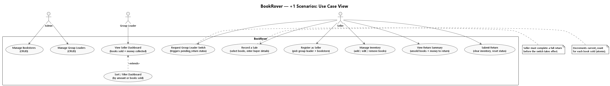

# arc42 — Section 1: Introduction and Goals

## 1.1 Purpose

BookRover is a mobile-first web application that manages the full lifecycle of a door-to-door book selling operation:

1. **Collect** books from a local bookstore on consignment.
2. **Sell** books door-to-door to individual buyers.
3. **Return** unsold books and collected money to the bookstore.

The app eliminates manual paper-based tracking and gives sellers, group leaders, and admins real-time visibility into inventory, sales, and collections.

---

## 1.2 Top Quality Goals

Listed in priority order:

| Priority | Quality Goal | Motivation |
|----------|-------------|------------|
| 1 | **Simplicity** | Sellers are non-technical users operating their phone at a buyer's doorstep. The app must require zero training. |
| 2 | **Mobile-First Usability** | All users access the app through a phone browser. Every page must work perfectly at 375px screen width. |
| 3 | **Correctness** | Inventory counts and money totals must always be accurate. Incorrect balances damage trust between sellers, group leaders, and the bookstore. |
| 4 | **Cost-Minimal Hosting** | The app serves a small friend group. AWS hosting cost must remain within the free tier (~$0/month at low usage). |
| 5 | **Maintainability** | The codebase must be clean, well-tested, and easy to extend — especially for adding authentication (Phase 6) and Terraform IaC (Phase 7). |

---

## 1.2a Use Case Diagram (+1 Scenarios View)

> Source: [diagrams/scenarios_use_cases.puml](diagrams/scenarios_use_cases.puml)
> Rendered PNG committed alongside the source file.

---

## 1.3 Stakeholders

| Stakeholder | Role | Key Expectations |
|-------------|------|-----------------|
| **Admin** | Manages group leaders and bookstore records | Simple CRUD interface; separate login; not visible to sellers |
| **Group Leader** | Oversees sellers; receives books from bookstore | Dashboard showing all sellers' performance; sortable by books sold and money collected |
| **Seller** | Collects books, sells door-to-door, returns unsold books + money | Fast, tap-friendly sale recording; clear inventory view; simple return summary |
| **Bookstore Owner** | Provides books on consignment; receives returns | Not a direct app user — is represented as data (bookstore entity) |
| **Developer (you)** | Builds and maintains the app | Clean codebase, well-tested, maintainable, and extensible |
