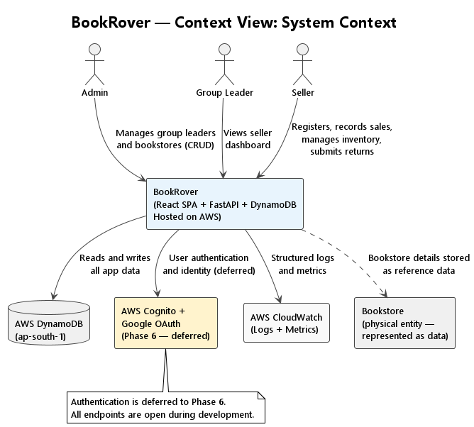

# arc42 — Section 3: Context and Scope

## 3.1 Business Context

BookRover sits at the centre of a consignment book-selling workflow. The diagram below shows what is inside the system and what is external.

> Source: [diagrams/context_system_context.puml](diagrams/context_system_context.puml)




```
┌─────────────────────────────────────────────────────────────┐
│                        BookRover App                         │
│                                                             │
│  ┌──────────┐   ┌──────────────┐   ┌───────────────────┐   │
│  │  Admin   │   │ Group Leader │   │      Seller       │   │
│  │  (user)  │   │    (user)    │   │      (user)       │   │
│  └──────────┘   └──────────────┘   └───────────────────┘   │
│       │                │                    │               │
│  Manages group    Views seller         Records sales,       │
│  leaders &        dashboard,           manages inventory,   │
│  bookstores       selects bookstore    submits returns      │
└─────────────────────────────────────────────────────────────┘
            │                                   │
            ▼                                   ▼
  ┌──────────────────┐               ┌──────────────────────┐
  │  Bookstore       │               │  Gmail / Google      │
  │  (external data) │               │  (Auth - Phase 6)    │
  │                  │               │                      │
  │ Represented as   │               │ Gmail OAuth for      │
  │ data in the app. │               │ identity federation  │
  │ Not a direct     │               │ via AWS Cognito      │
  │ app user.        │               │ (deferred)           │
  └──────────────────┘               └──────────────────────┘
```

---

## 3.2 System Scope

### Inside BookRover (what the system does)

- Manage bookstore records (name, owner, address, phone)
- Manage group leader profiles and their bookstore associations
- Manage seller profiles and their group leader / bookstore assignment
- Track each seller's personal book inventory (per bookstore)
- Record sales transactions (buyer details + books sold + amounts)
- Calculate and display return summaries (unsold books + collected money)
- Provide group leader with seller performance dashboard
- Enforce business rules (switch group leader only after full return)

### Outside BookRover (what the system does NOT do)

| External Concern | Notes |
|-----------------|-------|
| **Payment processing** | No payment gateway; money is cash, tracked as a running total only |
| **Bookstore's own inventory system** | BookRover tracks only what was given to sellers; not the bookstore's full stock |
| **Buyer management** | Buyer details are captured per sale but buyers are not managed as persistent profiles |
| **PDF / print reports** | Out of scope; return summary is screen-only |
| **Push notifications / SMS** | Out of scope |
| **Multi-currency** | ₹ only for now; configurable via env variable for future |
| **Offline mode** | App requires internet connection |

---

## 3.3 External Interfaces

| External System | Direction | Protocol | Purpose |
|----------------|-----------|----------|---------|
| **User's phone browser** | Inbound | HTTPS (via CloudFront) | All user interactions |
| **Gmail / Google OAuth** | Inbound (Phase 6) | OAuth 2.0 | Seller and admin authentication |
| **AWS DynamoDB** | Outbound | AWS SDK (boto3) | Persistent data storage |
| **AWS CloudWatch** | Outbound | AWS SDK | Structured logging and metrics |

---

## 3.4 User Roles and Their Boundaries

| User | Can Access | Cannot Access |
|------|-----------|---------------|
| **Admin** | Admin page (group leaders + bookstores CRUD) | Seller pages, Group Leader dashboard |
| **Group Leader** | Group Leader dashboard | Admin page, Seller's inventory/sales pages |
| **Seller** | Inventory, New Buyer, Return Books pages | Admin page, Group Leader dashboard |
