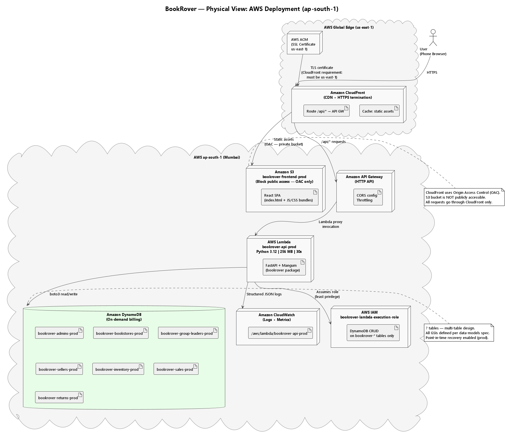

# arc42 — Section 7: Deployment View

## 7.0 Deployment Diagram

> Source: [diagrams/physical_aws_deployment.puml](diagrams/physical_aws_deployment.puml)



---

## 7.1 Production Deployment (AWS)

```
                    ┌─────────────────────────────────────┐
                    │         User's Phone Browser         │
                    └──────────────┬──────────────────────┘
                                   │ HTTPS (port 443)
                    ┌──────────────▼──────────────────────┐
                    │         AWS CloudFront               │
                    │  Region: us-east-1 (global edge)     │
                    │  - HTTPS termination                 │
                    │  - HTTP → HTTPS redirect             │
                    │  - Cache static assets               │
                    │  - Route /api/* to API Gateway       │
                    └──────────┬──────────────┬────────────┘
                               │              │
              Static assets    │              │  /api/* requests
                               │              │
              ┌────────────────▼──┐   ┌───────▼──────────────┐
              │     AWS S3        │   │   API Gateway         │
              │  ap-south-1       │   │   (HTTP API)          │
              │  bookrover-       │   │   ap-south-1          │
              │  frontend-prod    │   └───────┬──────────────┘
              │  (React build)    │           │ Lambda Proxy
              │  OAC access only  │   ┌───────▼──────────────┐
              └───────────────────┘   │   AWS Lambda          │
                                      │   ap-south-1          │
                                      │   Runtime: Python 3.12│
                                      │   Memory: 256 MB      │
                                      │   Timeout: 30s        │
                                      │   bookrover-api-prod  │
                                      └───────┬──────────────┘
                                              │ boto3
                                      ┌───────▼──────────────┐
                                      │   AWS DynamoDB        │
                                      │   ap-south-1          │
                                      │   On-demand billing   │
                                      │   7 tables            │
                                      └──────────────────────┘

  Supporting:
  ┌──────────────────┐  ┌──────────────────┐  ┌──────────────────┐
  │  CloudWatch      │  │    IAM           │  │  ACM (us-east-1) │
  │  ap-south-1      │  │  Lambda role     │  │  SSL Certificate │
  │  Log groups      │  │  + policies      │  │  (CloudFront)    │
  └──────────────────┘  └──────────────────┘  └──────────────────┘
```

---

## 7.2 Local Development Stack

```
Developer's Laptop
──────────────────────────────────────────────────────────
┌──────────────────┐     ┌──────────────────┐     ┌─────────────────┐
│  React Dev       │     │  FastAPI         │     │  moto_server    │
│  Server          │────►│  (uvicorn)       │────►│  OR             │
│  localhost:3000  │     │  localhost:8000  │     │  DynamoDB Local │
└──────────────────┘     └──────────────────┘     │  localhost:8001 │
                                                  └─────────────────┘

Automated Tests:
┌──────────────────────────────────────────────────────────┐
│  pytest + moto (in-memory) — no running process needed   │
│  Tests pass with zero AWS or network dependency          │
└──────────────────────────────────────────────────────────┘
```

---

## 7.3 AWS Manual Console Setup Order

Run these steps in sequence — each step depends on the previous:

| Step | Service | Action |
|------|---------|--------|
| 1 | IAM | Create `bookrover-lambda-execution-role` with DynamoDB + CloudWatch permissions |
| 2 | DynamoDB | Create all 7 tables + GSIs in `ap-south-1` (dev tables first) |
| 3 | Lambda | Create `bookrover-api-dev` function; runtime Python 3.12; attach IAM role; set env vars (add Cognito vars after Step 4) |
| 4 | Cognito | Create User Pool `bookrover-prod`; configure Email OTP app client (`ALLOW_USER_AUTH`); note Pool ID and Client ID; update Lambda env vars |
| 5 | API Gateway | Create HTTP API; Lambda proxy integration; configure CORS |
| 6 | S3 | Create `bookrover-frontend-dev` bucket; block public access; enable versioning |
| 7 | ACM | Request SSL cert in **us-east-1** for your domain; DNS validate via Route 53 |
| 8 | CloudFront | Create distribution; S3 origin (OAC) + API Gateway origin; attach cert; set error pages |
| 9 | Route 53 | (Optional) Create A alias record → CloudFront distribution |
| 10 | Deploy | Upload React build to S3; upload Lambda zip; smoke test via CloudFront URL |

Detailed step-by-step Console instructions are in [operator_guide.md](operator_guide.md).

---

## 7.4 AWS Regions Used

| Service | Region | Reason |
|---------|--------|--------|
| DynamoDB | `ap-south-1` (Mumbai) | Lowest latency for India-based users |
| Lambda | `ap-south-1` (Mumbai) | Co-located with DynamoDB; no cross-region latency |
| API Gateway | `ap-south-1` (Mumbai) | Co-located with Lambda |
| S3 | `ap-south-1` (Mumbai) | Consistent with other services |
| CloudFront | Global edge (configured in `us-east-1`) | CDN delivers from nearest edge node to user |
| ACM | **`us-east-1`** | AWS requirement for CloudFront certificates |
| CloudWatch | `ap-south-1` (Mumbai) | Same region as Lambda for log delivery |
| Cognito | `ap-south-1` (Mumbai) | Co-located with Lambda; JWKS endpoint same region as JWT verifier |

---

## 7.5 Environment Configuration

| Config Key | Dev Value | Prod Value |
|------------|-----------|------------|
| `APP_ENV` | `dev` | `prod` |
| `DYNAMODB_REGION` | `ap-south-1` | `ap-south-1` |
| `DYNAMODB_ENDPOINT_URL` | `http://localhost:8001` | *(not set — uses real AWS)* |
| `TABLE_PREFIX` | `bookrover` | `bookrover` |
| `LOG_LEVEL` | `DEBUG` | `INFO` |
| `CORS_ORIGIN` | `http://localhost:3000` | `https://<cloudfront-domain>` |
